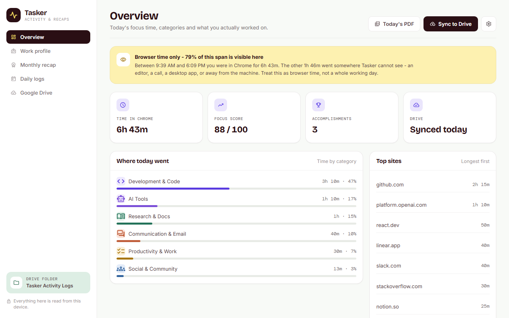
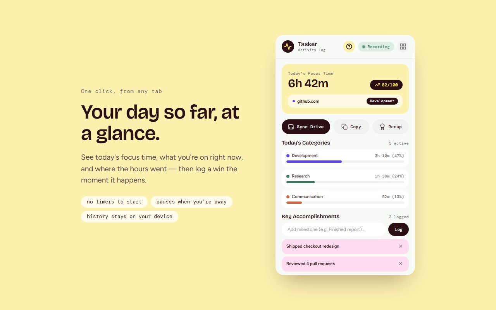
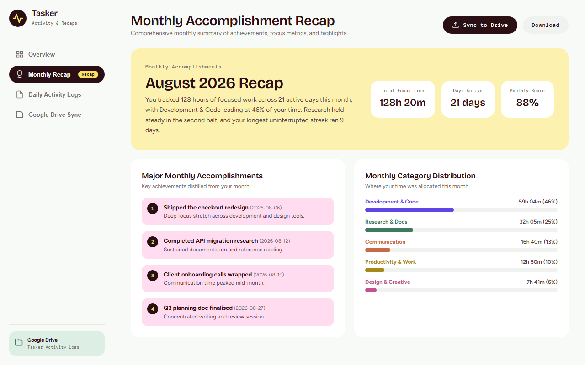
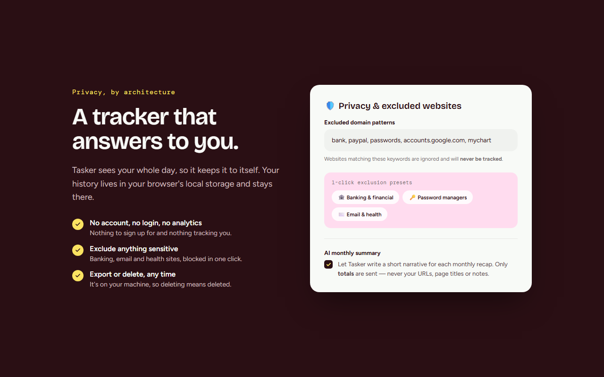

# Tasker — Activity Tracker & Google Drive Recap

A local-first Chrome extension that records how you actually spend your time in the browser and turns it into something you can hand to someone: a branded PDF report for the day and a monthly recap, optionally backed up to your own Google Drive.

No account. No login. No analytics. Your browsing history stays in `chrome.storage.local` on your machine.

[](LICENSE)




---

## Why it exists

Most people rebuild their week from memory. Timesheets, client invoices, status updates, performance reviews — all written days later from a vague recollection of what happened. Tasker keeps the record while you work, so when someone asks what you got done last month you have an answer instead of a guess.

## Features

- **Automatic tracking.** Time on the active tab is attributed to a domain and page title. No timers to start or stop. `chrome.idle` pauses tracking when you step away, so idle time is never counted as work.
- **Automatic categorisation.** Sixteen categories — Development, AI, Productivity, Research, Education, Design, Communication, Career, Finance, News, Health, Travel, Social, Shopping, Media — from a catalogue of over a thousand sites, plus hostname and page-title heuristics for everything not in it. Whatever still lands in "Unrecognised" is listed back to you in Settings, biggest first, to place in one click.
- **Daily focus score.** A 0–100 index derived from how your time was distributed, plus manual accomplishment notes you log as they happen.
- **Monthly recap hub.** Total focus time, active days, monthly focus score, milestones, and a category allocation breakdown.
- **Branded PDF reports.** Daily logs and monthly recaps render as real vector PDFs — cover page, stat tiles, category meters, running header and page numbers — written by a dependency-free PDF writer in `utils/pdf.js`. A typical daily report is ~26 KB. Markdown remains available as a setting.
- **Work profile (optional).** Infers what kind of work your browsing resembles across 54 roles, on-device, from the tools you spend time in. Refuses to answer below its evidence thresholds, shows a shortlist when two profiles score too closely, reports a title family rather than picking between interchangeable job titles, and carries the supporting evidence with every finding. Never transmitted; overridable.
- **Google Drive sync (optional).** OAuth 2.0 via `chrome.identity`, using the narrow `drive.file` scope: Tasker can only touch files it created, never the rest of your Drive. Uploads `Tasker_Daily_Log_YYYY-MM-DD.pdf` and `Tasker_Monthly_Recap_YYYY-MM.pdf` into `Daily Logs` and `Monthly Recaps` subfolders of a dedicated folder.
- **AI monthly summaries (optional).** A short narrative written by Gemini. Only aggregate totals leave the device — month, total seconds, active days, seconds per category. Never URLs, titles, domains, or notes. Switch it off and recaps are generated entirely offline by the rule-based summariser.
- **Privacy controls.** Exclude any domain from tracking with one click, pause tracking, export everything as JSON, or delete all data permanently.
- **One design system.** A single set of tokens across the popup, dashboard and settings, self-hosted fonts, and a bundled Material Symbols icon set — no remote asset is ever requested.

<p align="center">
  
  
  
</p>

## Install

### From source (recommended for development)

```bash
git clone https://github.com/EmperorDa8/tasker.git
cd tasker
python build_zip.py --unpacked
```

Then in Chrome:

1. Go to `chrome://extensions`
2. Enable **Developer mode** (top right)
3. Click **Load unpacked** and select **`build/unpacked/`**
4. Click the puzzle-piece icon in the toolbar and pin Tasker

The extension itself has no build step and no dependencies — it is plain
JavaScript loaded directly by Chrome. `--unpacked` only copies the extension
files into a clean folder, because **the repository root cannot be loaded
directly**: Chrome rejects any extension whose tree contains a name starting
with an underscore, and the repo carries a Remotion video project whose
`node_modules` is full of them. The command re-runs in under a second, so run it
again after editing and hit reload in Chrome.

> **Drive sync does not work in an unpacked build** unless the extension ID
> matches the one the OAuth client is registered against. An unpacked extension
> gets its ID from its folder path, so `chrome.identity` will reject the token
> request. Add the Web Store item's `"key"` to `manifest.json` to pin the ID, or
> register the unpacked ID as an additional OAuth client. Everything else —
> tracking, categorisation, the work profile, PDF export — works without it.

### Packaged release

Grab the latest `tasker-vX.Y.Z.zip` from [Releases](../../releases), unzip it, and load the folder the same way.

## Project layout

```
tasker/
├── manifest.json          # Manifest V3 configuration
├── background/
│   ├── service-worker.js  # Service worker & message hub
│   ├── tracker.js         # Tab tracking & idle monitoring
│   ├── summarizer.js      # Daily summaries & monthly recaps
│   └── driveSync.js       # Google Drive OAuth + Files API v3
├── popup/                 # Toolbar popup (html/css/js)
├── dashboard/             # Full analytics & monthly recap hub
├── options/               # Settings, privacy controls, export
├── utils/
│   ├── formatters.js      # Duration, domain, category, Markdown
│   ├── storage.js         # Abstraction over chrome.storage
│   ├── roleDetector.js    # On-device work-profile inference
│   ├── pdf.js             # Dependency-free PDF 1.4 writer
│   ├── reportBuilder.js   # What a Tasker report says, and in what order
│   └── ui.js              # Shared work-profile / theme / download helpers
├── server/                # Optional Gemini proxy (see below)
├── assets/
│   ├── design/tokens.css  # Colour, type, spacing, elevation — all surfaces
│   ├── fonts/             # Self-hosted woff2 (scripts/fetch_fonts.py)
│   └── icons/icons.js     # Bundled Material Symbols (scripts/build_icon_pack.py)
└── screenshots/           # Store screenshots + their HTML sources
```

## Regenerating bundled assets

Both are build-time steps that hit the network once and commit their output; the
extension itself never requests a remote asset, because its CSP forbids one.

```bash
python scripts/fetch_fonts.py       # -> assets/fonts/*.woff2 + fonts.css
python scripts/build_icon_pack.py   # -> assets/icons/icons.js
```

## The summary service (`server/`)

A published Chrome extension ships as readable source, so an API key embedded in it is public the moment you publish. `server/` is a zero-dependency Node 18+ HTTP service that holds the Gemini key instead: the extension posts aggregate totals, the service adds the key and calls Gemini.

Deploy it anywhere that runs Node — no install step, no build. Configuration is entirely through environment variables (`GEMINI_API_KEY`, `ALLOWED_EXTENSION_IDS`, rate limits). **Set the key in your host's dashboard; never commit it.** See [server/README.md](server/README.md) for the full variable table, deployment notes, and cost-control guidance.

If the service is down or misconfigured, the extension silently falls back to its offline rule-based summary. Nothing breaks.

## Running your own build

To point a fork at your own infrastructure:

1. **Summary service** — set `SUMMARY_SERVICE_URL` in `background/summarizer.js`, and update `host_permissions` in `manifest.json` to match your host.
2. **Google OAuth** — create an OAuth 2.0 client in the Google Cloud Console with the `https://www.googleapis.com/auth/drive.file` scope, and replace `oauth2.client_id` in `manifest.json`. A custom client ID can also be entered at runtime in the extension's Options page, with the redirect URI set to `https://<YOUR_EXTENSION_ID>.chromiumapp.org/`.

The client ID committed here is a public OAuth identifier, not a secret — but it is bound to this extension's ID, so a fork needs its own.

## Privacy

Tasker is local-first by design. Full details, including exactly what the optional features transmit, are in [PRIVACY_POLICY.md](PRIVACY_POLICY.md).

## Contributing

Issues and pull requests are welcome. A few things that make review easier:

- Keep the no-build-step, zero-dependency constraint — the extension loads unpacked as-is, and the server runs on stock Node.
- Anything that would send new data off the device needs to be opt-in, documented in the privacy policy, and default to off.
- Test by loading the unpacked extension and exercising the popup, dashboard, and options pages before opening a PR.

## Limitations

Tasker only sees activity inside Chrome. Time in desktop applications, video calls, or your editor is invisible to it.

## License

[MIT](LICENSE) — do what you like, no warranty.
